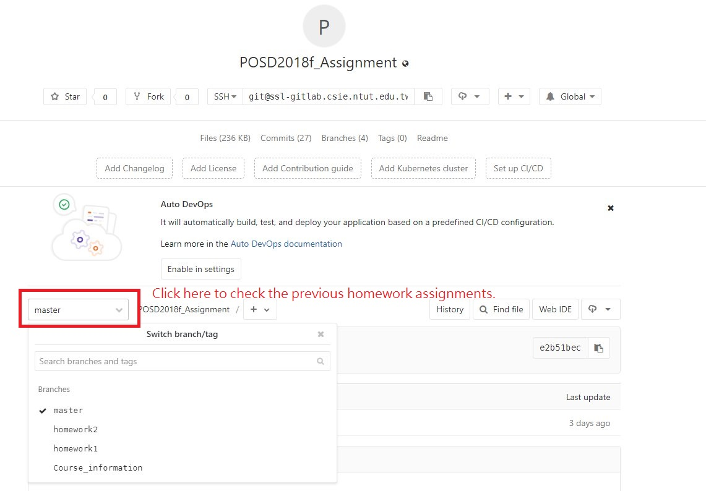

# Pattern Oriented Software Design
#### Fall, 2018
#### Dept. of Computer Science and Information Engineering
#### Taipei Tech

#### Homework 3

# Update

  18:00 p.m  28 Sep 2018

# Purpose of the homework:
  Resolve thr problem 1:sorting shapes

  The program with homework3 is needed to sort shapes such as triangles, circles, rectangles and others. As a command line application, hw3 reads shapes from an input file, sorts the shapes by area or perimeter in increasing order or decreasing order, and write the result to an output file. For example,

      bin/hw3 input.txt output.txt area inc

  sorts the shapes in file input.txt in increasing order by area, and writes the result to the file output.txt. And

      bin/hw3 input.txt output.txt perimeter dec

  sorts the shapes in file input.txt in decreasing order by perimeter, and writes the result to the file output.txt.

  command line argement:

  argument 1 : input file path.

  argument 2 : output file path.

  argument 3 : method (area or perimeter).

  argument 4 : order (inc or dec).

# Requirements:
 1. Create `main.cpp` in src folder with following interface below.

        int main(int argc, char *argv[]){
              //implementation
        }

 2. input.txt data specification should follow:

        Circle (1.5)
        Rectangle (2,3)
        Triangle (0,0,1,1,2,0)

        ※ Note: you must add a white space between class name and left round bracket.

 3. output.txt data specification should follow:

      Run the command line:  
      `bin/hw3 input.txt output.txt area inc`  
      The result in output.txt should be: 

        [1,6,7.06858]

      Run the command line:  
      `bin/hw3 input.txt output.txt perimeter dec`  
      The result in output.txt should be:

        [10,9.42478,4.82843]

 4. Write the corresponding makefile to generate executable file which named **`hw3`** in bin folder.

# Reference Answer

You can get the homework2 reference answer from this project src folder.

# Homework History 

You can check previous homework assignments in the following picture.

# Mark

TA assigned 4 test cases in CI.

# Deadline
11:59 p.m. 4 oct 2018

# Note
Make sure your tests on local are all pass. Then you can push to Gitlab and watch the report on Jenkins.